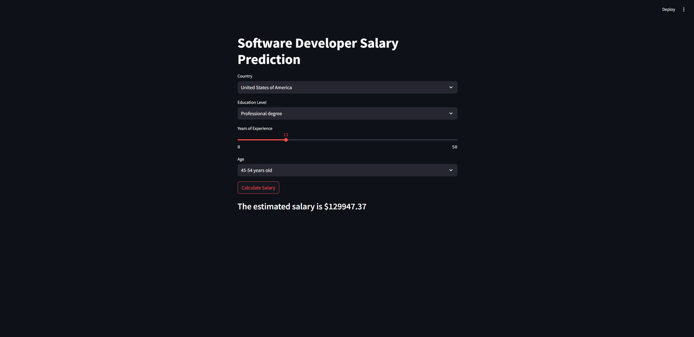

# Machine-Learning-Web-App
## Estimated Income Calculator

This repository contains a web application built with Streamlit that estimates your income based on various factors. The underlying model is a machine learning model trained on Stack Overflow's 2023 survey data.

## Features:
- User-friendly Interface: Easy-to-use web interface for inputting relevant details.
- Real-time Predictions: Instant estimation of your potential income based on the provided inputs.
- Advanced Machine Learning Model: The application leverages a Decision Tree Regressor model that has been tuned to provide accurate income predictions.
## How to Run
Clone the Repository:

git clone https://github.com/xKomil/Machine-Learning-Web-App.git
cd Machine-Learning-Web-App

## Install Dependencies:
Ensure you have Python installed (preferably version 3.7 or above). Install the required packages using pip:

pip install -r requirements.txt

## Run the Application:
Start the Streamlit application by running:

streamlit run app.py
This will start a local server, and you can access the application in your web browser at http://localhost:8501.

Input Fields
The application requires the following inputs to estimate your income:

Country: The country where you are employed.
Education Level: Your highest level of education.
Years of Professional Coding Experience: Number of years you have worked as a professional coder.
Age: Your age.
Output
The application will output an estimated yearly income based on the inputs provided.

Data Source
The model is trained on the 2023 Stack Overflow survey [data](https://survey.stackoverflow.co), which includes a wide range of variables and responses from software professionals worldwide.

Model
The machine learning model used is a Decision Tree Regressor, which was tuned using GridSearchCV for optimal performance.

